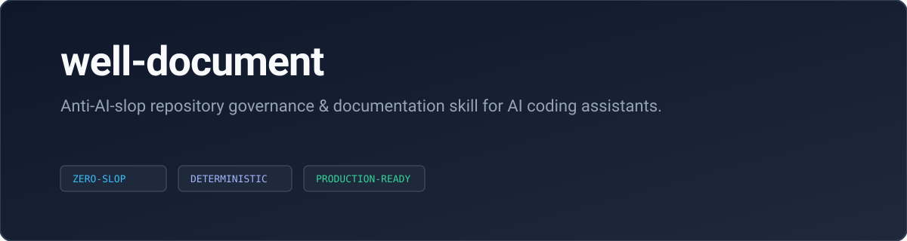

<div align="center">



# well-document

**Anti-AI-slop repository governance and documentation skill for AI coding assistants.**

[](LICENSE)
[](.github/workflows/ci.yml)
[](skills/well-document/SKILL.md)
[](#roadmap)
[](CONTRIBUTING.md)

</div>

---

## Overview

`well-document` is an open-source AI agent skill (compatible with Cursor, Claude Code, Antigravity, Windsurf, and custom agentic workflows) that transforms raw, undocumented codebases into clean, battle-tested open-source repositories.

Unlike generic boilerplate scripts or AI generators that produce emoji vomit and buzzword-heavy marketing fluff, `well-document` enforces structural rigor, authentic technical specifications, and production-grade governance.

---

## Table of Contents

- [Overview](#overview)
- [Technical Specifications](#technical-specifications)
- [Installation](#installation)
  - [Agent Compatibility Matrix](#agent-compatibility-matrix)
  - [Option 1: Skills CLI (Recommended)](#option-1-skills-cli-npx-skills-add-recommended)
  - [Option 2: One-Line POSIX Installer](#option-2-one-line-posix-installer)
  - [Option 3: Manual Configuration](#option-3-manual-agent-configuration)
- [Quick Start & Usage Scenarios](#quick-start--usage-scenarios)
- [Repository Structure](#repository-structure)
- [Frequently Asked Questions](#frequently-asked-questions)
- [Documentation](#documentation)
- [License](#license)

---

## Technical Specifications

- **Zero Buzzword Policy**: Strips meaningless adjectives (*"seamless"*, *"blazingly fast"*, *"revolutionary"*) in favor of concrete architectural contracts.
- **Strict Emoji Discipline**: Completely eliminates frivolous inline emojis. Top-level headers may feature at most one neutral, functional icon.
- **Grounding Verification**: Ensures all referenced file paths, package scripts, and dependencies physically exist on disk before emitting documentation.
- **Archetype Awareness**: Automatically selects the optimal documentation structure based on the project's interface:
  - **CLI Utility**: Flags, shell pipelines, subcommands, config files.
  - **Library / SDK**: API surface, typed import snippets, runtime matrices.
  - **Web / Backend Service**: Docker, environment variables (`.env.example`), migrations, endpoints.
  - **Monorepo**: Workspace mappings, topological build commands.
- **Governance Standards**: Implements private security vulnerability disclosure protocols (48h response SLA) and Conventional Commits enforcement.

---

## Installation

`well-document` can be installed globally across your system agent directories or linked directly into a specific project repository.

### Agent Compatibility Matrix

| AI Agent Environment | Global Skill Directory | Workspace-Level Path | Status |
| :--- | :--- | :--- | :---: |
| **Google Antigravity / Gemini CLI** | `~/.gemini/antigravity/skills/` | `.gemini/skills/` | Verified |
| **Claude Code** | `~/.claude/skills/` | `.claude/skills/` | Verified |
| **Cursor** | `~/.cursor/skills/` | `.cursor/skills/` | Verified |
| **OpenAI Codex / Copilot CLI** | `~/.codex/skills/` | `.codex/skills/` | Verified |

---

### Option 1: Skills CLI (`npx skills add` - Recommended)

The standard, package-managed way to install AI agent skills across Cursor, Claude Code, Antigravity, and Codex:

```bash
# Add to current workspace/project repository
npx skills add <owner>/well-document

# Install globally across all detected AI agents on your machine
npx skills add <owner>/well-document -g

# Install non-interactively to specific agents
npx skills add <owner>/well-document --agent cursor claude-code antigravity -y
```

---

### Option 2: One-Line POSIX Installer

Direct shell installer with zero dependencies:

```bash
# Auto-detect all installed agent environments
curl -fsSL https://raw.githubusercontent.com/example/well-document/main/install.sh | sh

# Or install for a specific agent target:
curl -fsSL https://raw.githubusercontent.com/example/well-document/main/install.sh | sh -s -- --antigravity
curl -fsSL https://raw.githubusercontent.com/example/well-document/main/install.sh | sh -s -- --claude
curl -fsSL https://raw.githubusercontent.com/example/well-document/main/install.sh | sh -s -- --cursor
curl -fsSL https://raw.githubusercontent.com/example/well-document/main/install.sh | sh -s -- --codex
curl -fsSL https://raw.githubusercontent.com/example/well-document/main/install.sh | sh -s -- --all
```

---

### Option 3: Manual Agent Configuration

#### 1. Google Antigravity & Gemini CLI
Add `well-document` to your global or project-level Gemini/Antigravity skills path:
```bash
# Global Antigravity skills directory
mkdir -p ~/.gemini/antigravity/skills/well-document
git clone https://github.com/example/well-document.git ~/.gemini/antigravity/skills/well-document

# Or as a workspace-specific skill in your active repository:
mkdir -p .gemini/skills/well-document
cp -r path/to/well-document/* .gemini/skills/well-document/
```

#### 2. Claude Code
Install into Claude Code's recognized skill inventory:
```bash
# Global skills directory
mkdir -p ~/.claude/skills/well-document
git clone https://github.com/example/well-document.git ~/.claude/skills/well-document

# Or repository-scoped rules
mkdir -p .claude/skills/well-document
cp -r path/to/well-document/* .claude/skills/well-document/
```

#### 3. Cursor
Configure as a Cursor skill or rule directory:
```bash
# Global Cursor skill definition
mkdir -p ~/.cursor/skills/well-document
git clone https://github.com/example/well-document.git ~/.cursor/skills/well-document

# Project-level Cursor rules (.cursorrules / .cursor/rules)
mkdir -p .cursor/skills/well-document
cp -r path/to/well-document/* .cursor/skills/well-document/
```

#### 4. OpenAI Codex & GitHub Copilot
Mount into your Codex / Copilot CLI instruction directory:
```bash
# Global Codex instruction path
mkdir -p ~/.codex/skills/well-document
git clone https://github.com/example/well-document.git ~/.codex/skills/well-document

# Or specify as a prompt instruction file:
export CODEX_INSTRUCTION_PATH="$HOME/.codex/skills/well-document/SKILL.md"
```

---

## Quick Start & Usage Scenarios

Once installed, invoke `well-document` within your AI coding assistant prompt:

### Scenario 1: Initializing a Raw Codebase

> **Prompt:** `"well-document init"`

The agent inspects your project manifests (`package.json`, `Cargo.toml`, `pyproject.toml`, etc.), identifies the project archetype, and generates:
- Clean, archetype-specific `README.md`
- Comprehensive `.gitignore` matching your exact runtime
- `SECURITY.md` with structured vulnerability reporting
- `CONTRIBUTING.md` with Conventional Commits and PR criteria
- Standard `LICENSE` (MIT)
- `ROADMAP.md` grounded in your actual milestones

### Scenario 2: Auditing Existing Repository Documentation

> **Prompt:** `"well-document audit"`

Evaluates your current documentation against the 6 evaluation gates (`G1–G6` in `references/slop-test.md`) and outputs an actionable punch list with zero unprompted file modifications.

### Scenario 3: Polishing a Bloated or AI-Slop Document

> **Prompt:** `"well-document polish README.md"`

Strips out rocket emojis, marketing copy, and unexecutable instructions, replacing them with accurate architectural descriptions and verifiable command blocks.

---

## Repository Structure

```text
.
├── .github/
│   ├── dependabot.yml               # Automated weekly dependency updates
│   └── workflows/
│       ├── ci.yml                   # Continuous integration (syntax, governance, anti-slop)
│       └── release-please.yml       # Automated CHANGELOG & semantic versioning releases
├── skills/
│   └── well-document/
│       ├── README.md                # Scoped subfolder documentation for the skill distribution
│       ├── SKILL.md                 # Primary AI agent skill definition & instructions
│       └── references/              # Knowledge bases loaded by the agent
│           ├── anti-patterns.md     # Catalog of AI-slop documentation tells & fixes
│           ├── archetypes.md        # Layout standards (CLI, Library, Web, Monorepo)
│           ├── automation.md        # CI/CD, Dependabot & Release Please integration standards
│           ├── diagrams.md          # Technical Mermaid diagram standards & anti-slop rules
│           ├── licensing.md         # Open-source legal triage & dependency compatibility matrix
│           └── slop-test.md         # 6-point pre-emit audit scorecard
├── install.sh                       # Portable POSIX shell installer
├── docs/
│   ├── recipes.md                   # Advanced recipes (CI actions, pre-commit, monorepos)
│   └── screenshots/                 # Asset guidelines & banner assets
├── CONTRIBUTING.md                  # Contribution standards & Conventional Commits
├── SECURITY.md                      # Vulnerability disclosure policy
├── ROADMAP.md                       # Version milestones
└── LICENSE                          # MIT License
```

---

## Frequently Asked Questions

#### Does `well-document` send codebase telemetry or code snippets off-machine?
No. `well-document` is a static AI agent skill consisting entirely of markdown rules and reference specifications. It executes strictly within your local AI agent session (Cursor, Claude Code, Antigravity) with zero telemetry, zero analytics, and zero external network calls.

#### How does this differ from traditional boilerplate generators (Cookiecutter, Yeoman)?
Traditional boilerplate generators copy static, rigid string templates and often overwrite or create fictional folders. `well-document` gives your AI assistant an anti-AI-slop protocol to inspect the real codebase tree, detect accurate entry points, infer project archetypes, and produce bespoke documentation that accurately reflects your real code.

#### Can our engineering team customize or enforce custom anti-slop rules?
Yes. You can fork or link this skill and edit `skills/well-document/references/anti-patterns.md` to add team-specific banned jargon, custom CI badges, or internal security reporting endpoints.

#### Can I install this with `npx skills add`?
Yes. `well-document` follows the standard Agent Skills specification. Once published to GitHub, any developer can install it via `npx skills add <owner>/well-document` or globally via `npx skills add <owner>/well-document -g`.

---

## Documentation

- [Contributing Guidelines](CONTRIBUTING.md)
- [Security Policy](SECURITY.md)
- [Project Roadmap](ROADMAP.md)
- [Advanced Recipes](docs/recipes.md)

---

## License

This project is licensed under the MIT License. See [LICENSE](LICENSE) for details.
