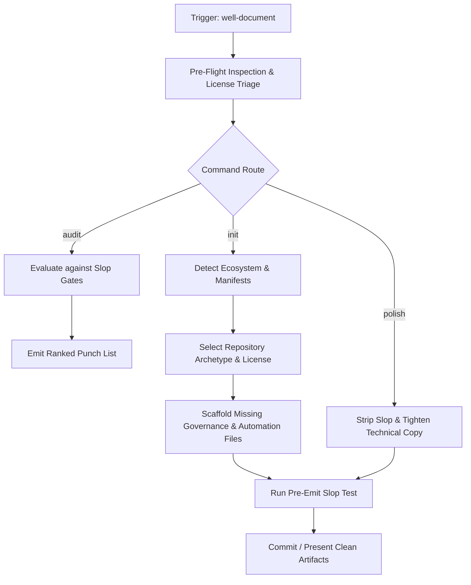

# well-document

A repository governance and documentation skill for AI coding assistants. Turns raw, undocumented codebases into production-grade, open-source repositories that look engineered, not generated.

Like Hallmark for frontend design, `well-document` is opinionated, technical, and anti-AI-slop. It systematically replaces generic boilerplate, emoji vomit, and marketing puffery with crisp technical architecture, real verification steps, and industry-standard governance.

---

## Invocations & Verbs

`well-document` operates through four explicit modes:

| Invocation | Action |
| --- | --- |
| `well-document init` *(default)* | Scans the codebase, detects language/runtime signatures, and scaffolds missing governance files with zero hallucinated content. |
| `well-document audit` | Inspects existing repository documentation against anti-AI-slop gates and returns a ranked punch list. **Makes no edits.** |
| `well-document polish <file>` | Rewrites a single documentation file (`README.md`, `CONTRIBUTING.md`, etc.) to eliminate AI slop, prune filler adjectives, and inject technical precision. |
| `well-document recipes` | Emits battle-tested recipes for CI governance enforcement, multi-package monorepos, and release automation. |

---

## Core Philosophy: Anti-AI Slop for Documentation

AI-generated documentation is instantly recognizable by common tells: rocket emojis, "comprehensive and robust", "cutting-edge architecture", empty feature tables, and placeholder URLs that lead nowhere. `well-document` strictly forbids this.

### Non-Negotiable Rules

1. **Zero Emoji Vomit**: Emojies are strictly banned from body copy. A single neutral icon may appear next to top-level section headers only if it serves functional visual parsing. Never use `:rocket:`, `:fire:`, `:sparkles:`, or `:tada:` in technical docs.
2. **No Fabricated Metrics or Social Proof**: Never invent statistics (*"99.9% uptime"*, *"trusted by 10,000 developers"*). If benchmarks do not exist in the code, do not write a benchmark section. Use real reproduction commands instead.
3. **No Fluff Adjectives**: Eliminate: *effortless, seamless, revolutionary, blazingly fast, cutting-edge, robust, comprehensive, ultimate, elegant*. State the technical mechanics plainly.
4. **Actionable Quick Start**: Every code block in Quick Start must be copy-paste executable against the actual repository tree. If a command requires environment variables, name them explicitly with a `.env.example` reference.
5. **Architectural Grounding**: Every directory listed in the file tree must actually exist in the repository. Never include speculative or generic directory trees.
6. **Visual Architecture via Mermaid**: When explaining subsystem interactions, data flows, protocols, or state transitions, always embed concise, dark/light-compatible Mermaid diagrams (`flowchart`, `sequenceDiagram`, `stateDiagram-v2`). Never rely on external images that break on theme change or walls of text. See [`references/diagrams.md`](references/diagrams.md).
7. **High-Signal Technical FAQ (Conditional)**: If the repository warrants it (e.g. tools with distinct trade-offs, telemetry/privacy questions, offline execution guarantees, or common alternative comparisons like "Why X instead of Y?"), include a technical FAQ section. Strictly forbid trivial filler questions ("Is this free?"). Every FAQ item must solve real developer doubts or explain design decisions.
8. **Legal License Compatibility**: Never assign an incompatible permissive license if dependencies impose copyleft obligations (GPL/AGPL). Never emit unpopulated placeholders (`<YEAR>`, `[fullname]`). Follow the triage matrix in [`references/licensing.md`](references/licensing.md).
9. **CI, Maintenance & Release Automation (Conditional)**: If the repository contains runnable tests, linters, or build scripts, scaffold `.github/workflows/ci.yml`. If it contains dependencies or actions, scaffold `.github/dependabot.yml`. If it adheres to Conventional Commits and publishes releases, scaffold `.github/workflows/release-please.yml`. Always embed the CI status badge in `README.md`. See [`references/automation.md`](references/automation.md).
10. **Pre-Emit Slop Gate**: Run the 6-point verification scorecard (`references/slop-test.md`) before generating or saving any documentation file.

---

## Execution Flow

### Step 0: Pre-Flight Inspection & Legal Triage
Before writing a single word, read the target repository:
- **Language / Runtime**: Detect package manifests (`package.json`, `Cargo.toml`, `pyproject.toml`, `go.mod`, `pom.xml`).
- **Existing Governance**: Check for `LICENSE`, `README.md`, `CONTRIBUTING.md`, `SECURITY.md`, `.gitignore`.
- **Public API / Entry Point**: Identify the primary CLI command, importable library modules, or main entry points.
- **Upstream Licensing Triage**: Scan linked dependencies for copyleft (GPL/AGPL) constraints, determine project distribution model, and extract author/organization identity. See [`references/licensing.md`](references/licensing.md).

### Step 1: Select Repository Archetype
Choose the structure matching the codebase's true nature (see [`references/archetypes.md`](references/archetypes.md)):
- **Library / SDK**: API surface, minimal dependencies, typed examples, package manager installation.
- **CLI Utility**: Command-line usage, flags, shell completion, zero-dependency execution.
- **Service / Web App**: Local setup, environment configuration, database migrations, container execution.
- **Monorepo / Multi-Package**: Workspace topologies, shared packages, independent package manifests.

### Step 2: Assemble Governance & Automation Files
Generate only missing or requested files:
- **`README.md`**: Minimalist banner/badge header (with CI status badge), single-sentence technical definition, copy-paste quick start, architecture tree (with Mermaid where relevant), verifiable examples, and a conditional high-signal FAQ section when warranted.
- **`.gitignore`**: Complete ignore rules for the detected runtime(s), IDEs, OS metadata, and secret files (`.env`).
- **`SECURITY.md`**: Active version support table, encrypted or private disclosure workflow, 48-hour response SLA.
- **`CONTRIBUTING.md`**: Conventional Commits specification, branch naming, local test commands, PR verification checklist.
- **`LICENSE`**: Legally compatible open-source license (MIT, Apache-2.0, MPL-2.0, AGPL-3.0) determined by dependency triage. Must include accurate current calendar year and extracted copyright owner with zero placeholder bracket residue.
- **`ROADMAP.md`**: Real milestones categorized by version tags, avoiding speculative promises.
- **`.github/workflows/ci.yml`** *(Conditional)*: Automated testing and validation pipeline tailored to detected runtimes (Python, Node.js, Rust, Go, or Shell/Markdown).
- **`.github/dependabot.yml`** *(Conditional)*: Automated dependency update schedules when package manifests or CI workflows exist.
- **`.github/workflows/release-please.yml`** *(Conditional)*: Automated CHANGELOG and semantic release tagging when Conventional Commits are followed.

### Step 3: Self-Critique & Pre-Emit Verification
Score the generated documentation against the 6 gates in [`references/slop-test.md`](references/slop-test.md):
1. **Verifiability**: Can the quick start be executed verbatim?
2. **Brevity**: Are there unnecessary introductory paragraphs or cheerleading?
3. **Restraint**: Is emoji usage zero or strictly minimal?
4. **Accuracy**: Does the file tree match the real repository layout?
5. **Security**: Are disclosure instructions private and explicit?
6. **Governance**: Are PR requirements and commit formats stated clearly?
