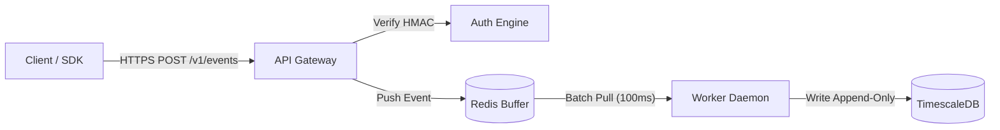
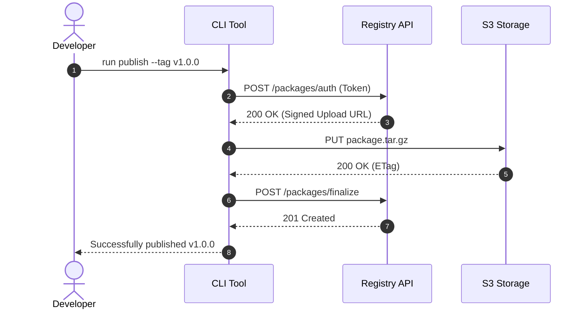
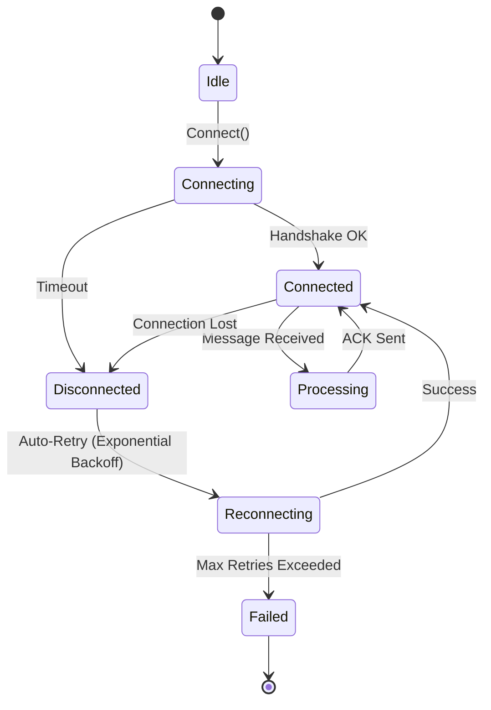

# Technical Architecture & Workflow Diagrams (Mermaid)

Modern GitHub markdown natively renders Mermaid.js diagrams. Instead of walls of text or external raster images that break on dark mode, use Mermaid to visualize architecture, control flow, and data lifecycles.

---

## When to Use Mermaid

Add a Mermaid diagram whenever documentation describes:
1. **System / Component Architecture**: High-level topologies, service boundaries, and internal module relationships.
2. **Request / Event Lifecycles**: How data moves between client, gateway, queue, workers, and storage.
3. **State Machines**: Order states, transaction lifecycle, connection states.
4. **CLI / Pipeline Workflows**: Build steps, CI checks, or release trains.

---

## Diagram Types & Best Practices

### 1. Flowcharts (`flowchart TD` / `flowchart LR`)
Use for component architecture and pipelines. Keep top-to-bottom (`TD`) for vertical workflows and left-to-right (`LR`) for pipelines.

**Rules**:
- Wrap node labels containing punctuation, parentheses, or paths in double quotes: `A["Label (Detail)"]`.
- Use specific node shapes: `[Box]`, `(["Rounded"])`, `[("Database / Store")]`, `{"Decision"}`.
- Always label directional connections with explicit verbs or protocols: `-->|"HTTPS / REST"|`.

### 2. Sequence Diagrams (`sequenceDiagram`)
Use for protocols, authentication handshakes, and multi-actor interaction lifecycles.

**Rules**:
- Always include `autonumber` for unambiguous step-by-step references in accompanying text.
- Differentiate between synchronous calls (`->>`), asynchronous messages (`-)`), and replies (`-->>`).

### 3. State Diagrams (`stateDiagram-v2`)
Use for finite state machines, connection lifecycles, and lifecycle transitions.

---

## Anti-AI-Slop Rules for Diagrams

1. **Max 10 Nodes**: Do not generate massive, unreadable 40-node spiderwebs. Focus on the core contract or subsystem being documented.
2. **No Fictional Entities**: Every service, database, or module in the diagram must physically correspond to a component in the codebase.
3. **No Unstyled Confetti**: Avoid random custom CSS classes or rainbow fills. Rely on GitHub's native theme styling or minimalist, high-contrast dark/light compatible node shapes.
4. **Readable in Both Dark and Light Themes**: Never force hardcoded white or black backgrounds on nodes that break theme switching.
