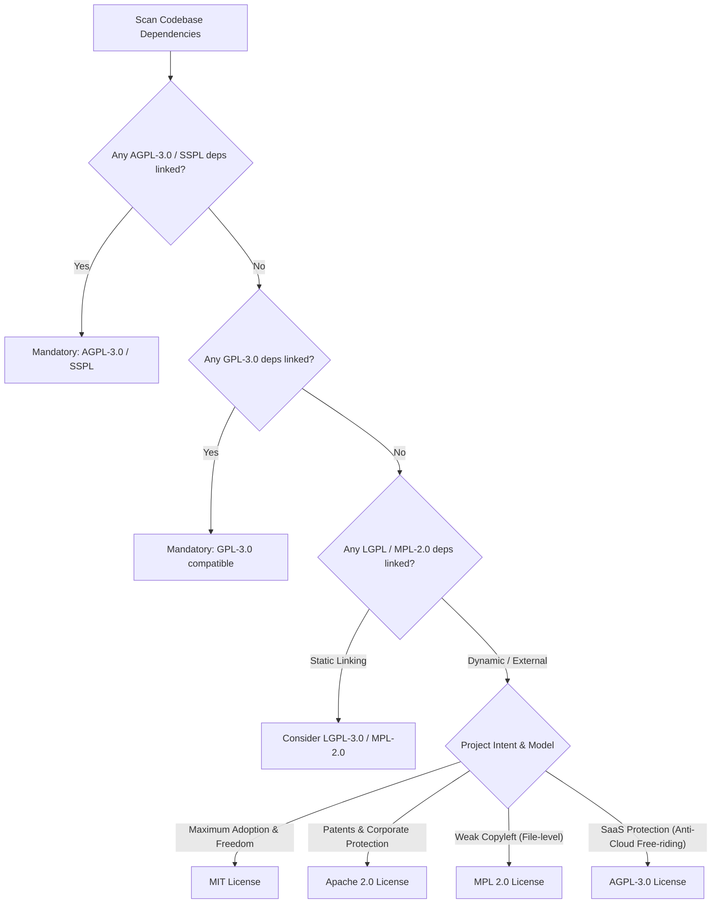

# Open Source Licensing & Legal Compatibility Guide

Selecting and generating a license is a legal boundary decision. An AI coding assistant must evaluate the repository's dependencies, architectural exposure, and distribution model to emit the legally appropriate license rather than blindly dumping MIT everywhere.

---

## 1. Upstream Dependency & Compatibility Triage

Before assigning a license, inspect the codebase's manifests (`package.json`, `Cargo.toml`, `pyproject.toml`, `go.mod`, `pom.xml`):

### Critical Compatibility Constraints
- **Infectious Copyleft (GPL-2.0, GPL-3.0, AGPL-3.0)**: If a project links or compiles directly against GPL-licensed libraries, the downstream project **cannot** be released under a purely permissive license (MIT/Apache) without violating upstream copyright. It must adopt a compatible GPL/AGPL license.
- **Weak Copyleft (LGPL, MPL-2.0)**: File-level copyleft permits permissive or proprietary codebases to link dynamically without relicensing the host project, provided modifications to the library itself remain open source.
- **Permissive (MIT, BSD-2/3, Apache-2.0)**: Free for proprietary reuse, modification, and sublicensing.

---

## 2. Decision Matrix: Selecting the Right License

| License | Type | Best For | Patent Grant? | Commercial Use? | Disclose Source? |
| --- | --- | --- | --- | --- | --- |
| **MIT** | Permissive | Small libraries, CLI tools, developer utilities, minimal friction. | No explicit grant | Allowed | Not required |
| **Apache-2.0** | Permissive | Enterprise SDKs, systems with potential patent claims, corporate contributions. | **Yes** (Explicit retaliation clause) | Allowed | Not required |
| **BSD-3-Clause** | Permissive | Academic code, scientific computing; restricts using author names for endorsements. | No | Allowed | Not required |
| **MPL-2.0** | Weak Copyleft | Core engines where file modifications must be shared, but surrounding app remains proprietary. | **Yes** | Allowed | Only modified files |
| **AGPL-3.0** | Strong Copyleft | Backend web services, SaaS infrastructure where network access triggers copyleft obligations. | **Yes** | Allowed | Full source mandatory |
| **GPL-3.0** | Strong Copyleft | Desktop software, developer tools where forks must remain open source forever. | **Yes** | Allowed | Full source mandatory |
| **Unlicense / CC0** | Public Domain | Dedicated to public domain; zero restrictions. | No | Allowed | Not required |

---

## 3. License Generation Hygiene (Anti-AI-Slop Rules)

1. **Zero Placeholder Bracket Pollution**:
   - **Banned**: `Copyright (c) [YEAR] [OWNER]`, `Copyright (c) <YEAR> <AUTHOR>`
   - **Required**: Automatically resolve the current calendar year (e.g., `2026`) and author name (extracted from `git config user.name`, `package.json`, or directory author metadata).
2. **Dual Licensing Clarification**:
   - If a project uses dual licensing (e.g., `MIT OR Apache-2.0` common in Rust ecosystems), explicitly document both licenses and supply `LICENSE-MIT` and `LICENSE-APACHE`.
3. **SPDX Identifier Requirement**:
   - Include standard SPDX identifiers in package manifests and source headers:
     `SPDX-License-Identifier: MIT` or `SPDX-License-Identifier: Apache-2.0`.
